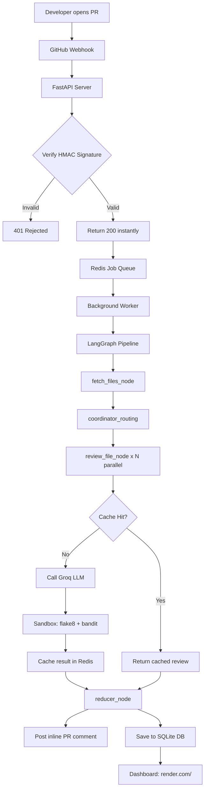

# HAYATO, AI-Powered GitHub PR Review Engine

HAYATO is a bot that automatically reviews every Pull Request opened on your GitHub repos. It catches security vulnerabilities, logic bugs, and code quality issues, then posts a structured review comment directly on the PR within seconds.

Live at: **https://hayato-whcq.onrender.com**

---

## Table of Contents

1. [Architecture](#architecture)
2. [How It Works](#how-it-works)
3. [Features](#features)
4. [Tech Stack](#tech-stack)
5. [Setup Locally](#setup-locally)
6. [Environment Variables](#environment-variables)
7. [Connecting a Repo](#connecting-a-repo)
8. [Dashboard](#dashboard)
9. [What I Learned](#what-i-learned)
10. [Project Structure](#project-structure)

---

## Architecture



---

## How It Works

1. Developer opens a PR on GitHub
2. GitHub sends a webhook event to the server
3. Server validates the HMAC signature, and fake requests are rejected with a 401
4. Server returns 200 instantly and drops the job into a Redis queue
5. Background worker picks up the job with no timeout pressure
6. LangGraph fans out file reviews in parallel using the Send API
7. Each file is classified by risk tier, and high risk files get routed to a more powerful model
8. Redis cache is checked first, so unchanged code is never reviewed twice
9. Groq LLM reviews each file and returns structured findings
10. Sandbox runs flake8 and bandit on Python files to catch static issues
11. All reviews are combined and posted as a comment on the PR
12. Review is saved to the database and shows up on the dashboard

---

## Features

- **Parallel file review:** LangGraph Send API fans out N files at the same time
- **~90% LLM cost reduction:** semantic caching at the function level in Redis
- **Never times out:** async job queue responds to GitHub in under 50ms
- **Security-first:** HMAC-SHA256 signature validation on every incoming webhook
- **Risk-based routing:** high risk files like auth, crypto, and payments get a deeper review
- **Sandbox validation:** every Python file goes through flake8, bandit, and py_compile
- **Structured reviews:** every comment includes a Summary, Issues, Severity, Fix, and Verdict
- **Review dashboard:** live history of all PRs reviewed, available at `/`
- **Zero budget:** runs entirely on free tiers

---

## Tech Stack

| Tool | Why |
|---|---|
| **FastAPI** | Async Python web framework that handles concurrent webhooks cleanly |
| **LangGraph** | Parallel map-reduce agent pipeline using the Send API |
| **Groq API** | Free LLM inference running Llama 3.3 70B for reviews |
| **Redis Cloud** | Used as both the job queue and semantic cache, free tier |
| **PyGithub** | GitHub API wrapper for fetching diffs and posting comments |
| **LiteLLM** | Unified interface for routing requests to different LLM providers |
| **SQLAlchemy** | ORM that works with SQLite locally and PostgreSQL in production |
| **flake8 + bandit** | Static analysis sandbox for Python files |
| **Docker** | Keeps local and production environments consistent |
| **Render** | Free cloud deployment kept alive with UptimeRobot |

---

## Setup Locally

1. **Clone the repo**

   ```bash
   git clone https://github.com/YOUR_USERNAME/pr-review-bot.git
   cd pr-review-bot
   ```

2. **Create a virtual environment**

   ```bash
   python -m venv venv
   source venv/bin/activate  # Windows: venv\Scripts\activate
   ```

3. **Install dependencies**

   ```bash
   pip install -r requirements.txt
   ```

4. **Set up environment variables**

   ```bash
   cp .env.example .env
   # fill in your keys
   ```

5. **Run the server**

   ```bash
   uvicorn app.main:app --reload
   ```

6. **Expose locally for testing**

   ```bash
   ngrok http 8000
   # paste the ngrok URL as your GitHub webhook URL
   ```

---

## Environment Variables

| Variable | What it does |
|---|---|
| `GITHUB_WEBHOOK_SECRET` | Secret used to validate incoming GitHub webhook signatures |
| `GITHUB_TOKEN` | Personal access token for reading PRs and posting comments |
| `GROQ_API_KEY` | API key for Groq LLM inference |
| `GEMINI_API_KEY` | API key for Gemini, used as a fallback for high risk files |
| `REDIS_URL` | Redis connection URL for the job queue and cache |
| `DATABASE_URL` | Database URL, defaults to SQLite if not set |

Make sure to create a `.env.example` file with empty values so anyone cloning the repo knows what keys they need.

---

## Connecting a Repo

1. Go to your GitHub repo, then Settings, then Webhooks, then Add webhook
2. Set the Payload URL to `https://your-server.onrender.com/webhook`
3. Set Content type to `application/json`
4. Set Secret to your `GITHUB_WEBHOOK_SECRET` value
5. Select **Pull requests** events only
6. Click Add webhook

After that, every PR opened on that repo will be automatically reviewed.

---

## Dashboard

Visit `https://hayato-whcq.onrender.com/` to see all reviewed PRs. Each entry shows:

- Repository name
- PR number
- Verdict (APPROVE / REQUEST CHANGES / NEEDS DISCUSSION)
- Number of issues found
- Files reviewed
- Date reviewed

---

## What I Learned

Building this project taught me a lot about how production systems actually work. I spent real time debugging things that tutorials never cover, like GitHub webhook signature validation breaking because Cloudflare lowercases HTTP headers, or Redis Cloud throwing connection limit errors because blocking `brpop` holds connections open longer than expected.

The biggest lesson was getting a proper handle on async programming. Every `await` is a point where the event loop is free to handle another request, and without understanding that, the whole job queue pattern just doesn't click.

LangGraph's Send API took the most time to wrap my head around. The key insight is that the coordinator is a routing function, not a node. It returns Send objects that tell LangGraph what to run next, which is what makes true parallel fan-out possible at runtime.

---

## Project Structure

```
pr-review-bot/
├── app/
│   ├── main.py         # FastAPI app, lifespan, routes
│   ├── webhook.py      # webhook receiver and event validation
│   ├── security.py     # HMAC-SHA256 signature validation
│   ├── github.py       # GitHub API: fetch diffs, post comments
│   ├── reviewer.py     # LLM review with structured prompts
│   ├── graph.py        # LangGraph parallel pipeline
│   ├── worker.py       # background job processor
│   ├── queue.py        # Redis enqueue and dequeue
│   ├── cache.py        # semantic function-level caching
│   ├── database.py     # SQLAlchemy models and queries
│   ├── utils.py        # risk classification
│   └── static/
│       └── index.html  # review history dashboard
├── Dockerfile
├── .dockerignore
├── requirements.txt
└── README.md
```

---