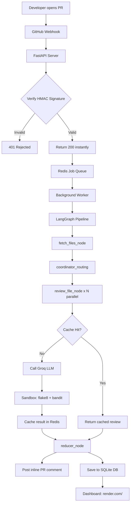

# HAYATO

## About
An autonomous, multi agent code remediation engine built with LangGraph. Parallel analyzes GitHub pull requests for vulnerabilities, implements multi provider API fallbacks, and generates verified patches

## Architecture

